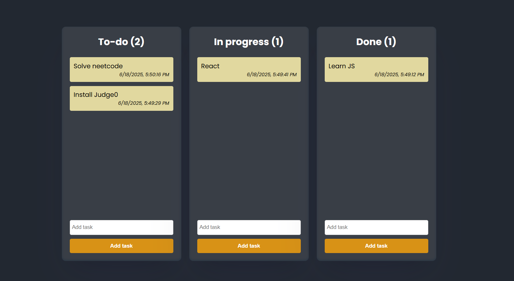

# 🗂️ Kanban Board Clone

This project is a simple and clean Kanban board built using HTML, CSS, and vanilla JavaScript.



## 🚀 Features

- Add, edit, and delete tasks
- Drag and drop tasks across columns (To-do, In Progress, Done)
- Reorder tasks within each column
- Persistent data using `localStorage`
- Responsive and minimalist UI

## 🛠️ Tech Stack

- HTML
- CSS
- JavaScript (no libraries or frameworks)

## 📁 How to Use

1. Clone the repository:
   ```bash
   git clone https://github.com/yourusername/kanban-board-clone.git
2. Open index.html in your browser.
3. Start adding and organizing your tasks!

Feel free to use or modify this project for your own learning or productivity!

📚 What I Learned
How to use localStorage to persist UI state

DOM manipulation for creating and updating elements

Drag-and-drop API in JavaScript

Styling interactive UI components with CSS

📩 Contributions
Suggestions and improvements are welcome!

